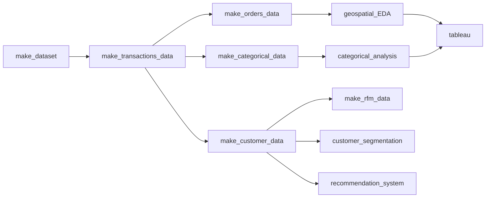

ISSS621 - Data Science for Business - Closed Loop Data Ecosystem
==============================

Table of Contents
------------

| S/NO | Section |
| --- | --- |
| 1. | [About this Project](#1) | 
| 2. | [Setup Environment](#2) | 
| 3. | [Run project pipeline](#3) |
| 4. | [Teardown Environment](#4) | 
| 5. | [Project Organization](#5) |
| 6. | [Development Workflow](#6) | 
| 7. | [Pull Requests](#7) | 


About this Project <a name="1"></a>
------------

Olist is an e-commerce company headquartered in Brazil. The organisation serves as an integrated platform for sellers to sell their goods at the online marketplace to a wider customer base. 

The platform, known as the Olist store, includes several features, such as inventory management, order fulfilment, and automated customer services, to help buyers and sellers to transact online in a smooth and fuss-free manner.

Given the wealth of data that Olist collects from its various platforms, we are interested to use the business as a case study on how to effectively leverage data using Data Science principles to maximise business productivity and customer relationships.

The main pipeline of our project consists of several components

### Project Pipeline



Setup Environment <a name="2"></a>
------------

### Prerequisites 

* Download and install [anaconda](https://www.anaconda.com/products/distribution) 

* Download [docker](https://www.docker.com/products/docker-desktop/) 

* Download [git](https://git-scm.com/downloads) 

In your terminal of choice, run the following terminal commands 

```bash
git clone https://github.com/csanry/dsb.git
cd dsb
```

Ensure that you are logged into docker hub. Then run the following command to set up the docker environment 

```bash
docker login
make project-up
```

The command launches an Ubuntu-based distro, and a Jupyter Lab environment for running the pipelines. Launch the Lab environment from the terminal by clicking on the generated URL


Run project pipeline <a name="3"></a>
------------

The root path of the source code is `project`

```bash
cd project
```

Run a pre-clean of the environment using 

```bash
make clean
```

In the environment, run the following command in an open terminal. 

```bash
make pipe
```

The command runs a pipeline that: 
- Downloads the data from Kaggle 
- Runs several preprocessing components to clean and transform the raw data into a suitable form for: 
    - Customer-level analysis
    - Temporal analysis 
    - Factor-level analysis (based on product categories)


Teardown the environment <a name="4"></a>
------------

Close the jupyter lab instance and run the follow commands in your terminal of choice

```bash
make project-down
```


Project Organization <a name="5"></a>
------------

The repository is structured with the following hierarchy

```
├── Dockerfile
├── LICENSE
├── Makefile
├── README.md
├── data
│   ├── fin
│   ├── int
│   │   ├── category_agg.parquet
│   │   ├── cust_agg.parquet
│   │   ├── orders_agg.parquet
│   │   ├── rfm.parquet
│   │   └── transactions.parquet
│   └── raw
│       ├── olist_customers_dataset.csv
│       ├── olist_geolocation_dataset.csv
│       ├── olist_order_items_dataset.csv
│       ├── olist_order_payments_dataset.csv
│       ├── olist_order_reviews_dataset.csv
│       ├── olist_orders_dataset.csv
│       ├── olist_products_dataset.csv
│       ├── olist_sellers_dataset.csv
│       └── product_category_name_translation.csv
├── docker-compose.yaml
├── environment.yaml
├── image
├── notebooks
│   ├── clustering.ipynb
│   ├── delivery.ipynb
│   ├── eda_customers.ipynb
│   ├── eda_products.ipynb
│   ├── geospacial.ipynb
│   ├── mba_analysis.ipynb
│   ├── missingness_transactions.ipynb
│   ├── recommender.ipynb
│   ├── rfm.ipynb
│   └── time_series.ipynb
├── run_pipeline.sh
├── setup.py
└── src
    ├── __init__.py
    ├── config.py
    ├── helpers
    │   ├── __init__.py
    │   ├── missingness_checks.py
    │   ├── quick_eda.py
    │   ├── setup_credentials.py
    │   └── standardize_cols.py
    ├── ingest
    │   ├── __init__.py
    │   └── make_dataset.py
    ├── interim
    │   ├── __init__.py
    │   ├── make_category_data.py
    │   ├── make_customers_data.py
    │   ├── make_orders_data.py
    │   ├── make_rfm_data.py
    │   └── make_transactions_data.py
    ├── make_transactions_data.py
    └── preprocessing.py
```

Development workflow <a name="6"></a>
------------

We utilised the [github flow](https://githubflow.github.io/) philosophy where:

- Features should be developed on branches

- Whenever you think that the branch is ready for merging, open a pull request

- Why? Ensures that main branch is as clean and deployable as possible, no conflicts due to competing branches

- For more information, refer to this [article](https://githubflow.github.io/)

Pull requests <a name="7"></a>
------------

```bash
# checkout a branch
git checkout -b cs --track origin/main

# add and commit changes to the branch
git add .
git commit -m "message" -m "more detail on changes made" 

# push changes
git push origin cs
```

* Head to the main [repo](https://github.com/csanry/dsb), find your branch, and click on "new pull request" 

* Enter a __descriptive__ title and description for your pull request

* Click on reviewers on the right side and request a review 

* Select `create pull request` 


